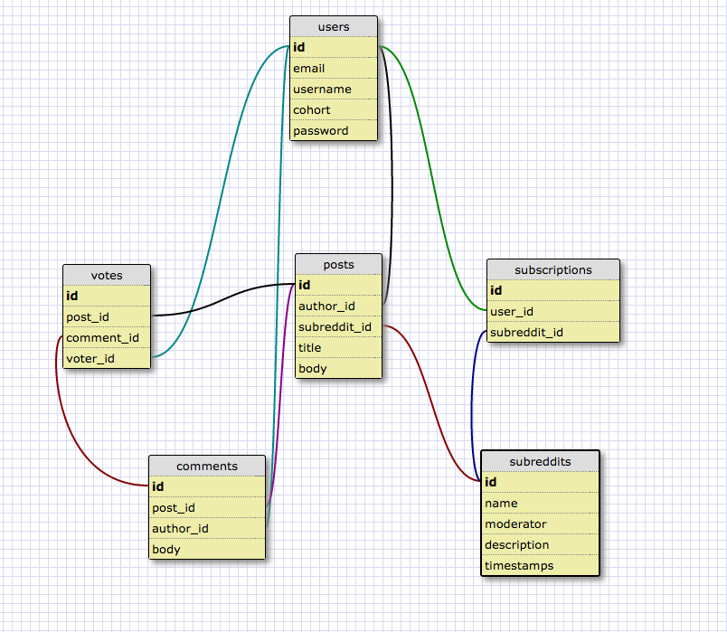

DBC-reddit
==========


### Team: Patrick, Emily, John, & Alex

Our project is to build a DBC specific version of Reddit, that would allow a user to login through socrates and view, create, edit and delete a post. Users would also be able to vote on comments and posts, and would have a home page that shows the most popular and recent posts from their subreddits.

###How to do stuff
```
git clone https://github.com/johnw335/DBC-reddit.git
cd DBC-reddit
be rake db:create && rake db:migrate && rake db:seed
rails server
```

###Trello Board
[Trello Site](https://trello.com/b/OHTeN4sL/dbc-reddit-app)

###Heroku Link
[Heroku Link](https://frozen-headland-3206.herokuapp.com/subreddits)

###Schema Design


###User Stories
* As a user, I want to sign in using my socrates account
* As a user, I want to view all of the posts in descending order by votes
* As a user, I want to create posts
* As a user, I want to edit and delete posts that I have made
* As a user, I want to comment on posts
* As a user, I want to vote on posts
* As a user, I want to vote on comments
* As a user, I want to create a subreddit
* As a user, I want to subscribe to a subreddit


